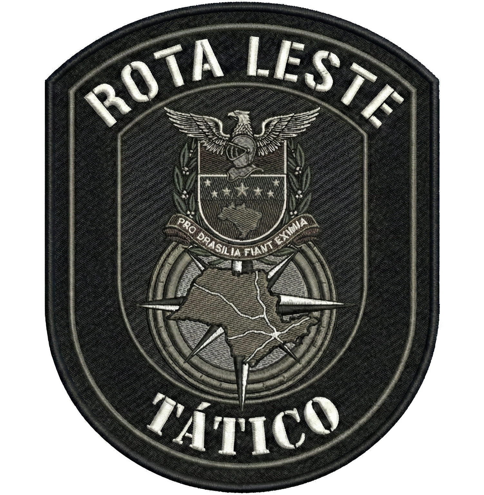

# Rota Leste Tático - Website Institucional

Este repositório contém o código-fonte do website oficial da **Rota Leste Tático**, especializada em recuperação veicular e pronta resposta na Zona Leste de SP e Alto Tietê.

## 📋 Sobre o Projeto

O site foi desenvolvido para ser uma ferramenta de alta conversão, transmitindo autoridade, confiança e agilidade para clientes em situações de emergência (roubo ou furto de veículos).

**Principais Funcionalidades:**
*   **Galeria de Sucesso:** Exibição de recuperações reais (veículos preservados).
*   **Página "Galeria Completa":** Acesso a todo o histórico de operações (+100 fotos).
*   **Área de Parceiros:** Canal de recrutamento para agentes de Pronta Resposta e Guinchos.
*   **Depoimentos:** Prova social com relatos de clientes.
*   **Integração WhatsApp:** Botões de ação direta (CTA) para contato imediato.

## 🚀 Como Executar

Este projeto é **estático** (HTML/CSS/JS Puro). Não requer instalação de servidores ou bancos de dados complexos.

### Visualização Local (Computador)
1.  Navegue até a pasta do projeto.
2.  Dê um duplo clique no arquivo `index.html`.
3.  O site abrirá no seu navegador padrão.

### Estrutura de Arquivos

*   `index.html`: Página inicial (Home) com destaques e informações principais.
*   `galeria.html`: Página secundária com o acervo completo de fotos.
*   `parceiros.html`: Página de cadastro para novos colaboradores (Tático e Guincho).
*   `style.css`: Folha de estilos contendo todo o design, cores e animações.
*   `Logo.png`: Logotipo oficial da empresa.
*   `favicon.png`: Ícone da aba do navegador.
*   `fotos/`: Diretório contendo todas as imagens das recuperações (Parte 1).
*   `fotos2/`: Diretório contendo imagens adicionais (Parte 2).
*   `assets/`: Diretório de arquivos de suporte (imagens de fundo, etc).

## 🎨 Identidade Visual

*   **Cores Principais:** Amarelo (#FFB400) e Preto (Fundo Dark).
*   **Tipografia:** Roboto (Google Fonts).
*   **Estilo:** Tático, Militar, Premium, Alta Performance.

## 📞 Contato

**Rota Leste Tático**
*   **Plantão 24h:** (11) 95962-9722
*   **Área de Atuação:** Zona Leste SP, Mauá, Ferraz, Suzano, Mogi das Cruzes.

---
*Desenvolvido em Jan/2026 para Rota Leste Tático.*
